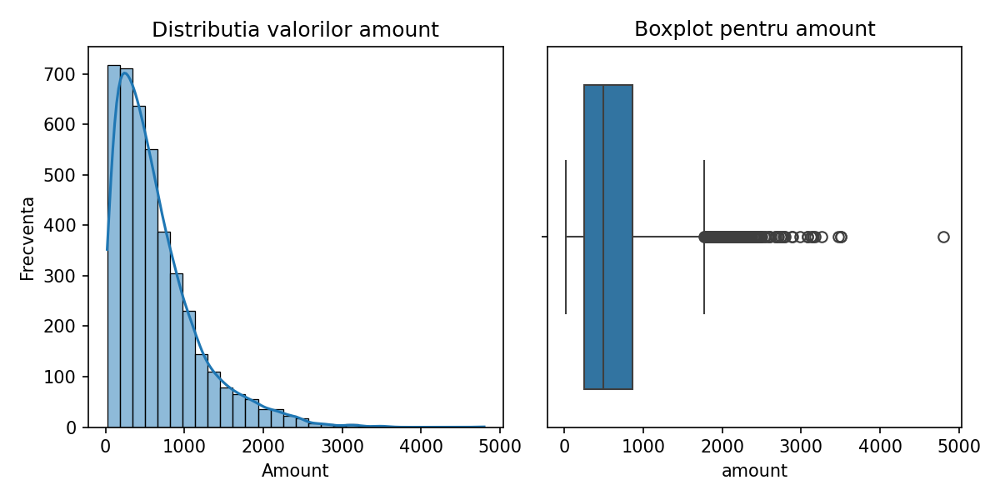
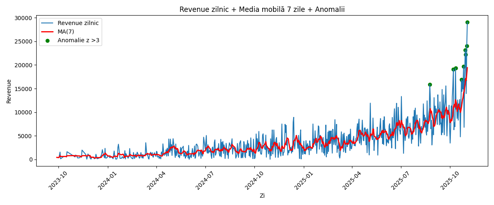

# Mini-Raport E-commerce Analysis

## 1. Obiectiv
Acest proiect urmărește realizarea unui mini-raport complet de analiză pentru date e-commerce folosind **Python, Pandas și DuckDB**.  
Se calculează KPI principali, se analizează funnel-ul utilizatorilor, se efectuează un A/B test și se detectează anomalii în revenue.

---

## 2. Curățare și preprocesare
- Conversie coloane de tip dată (`order_date`, `event_time`, `signup_date`, `day`) la tip `datetime`.  
- Eliminarea duplicatelor din `order_items`.  
- În `subscriptions`, valorile null din `canceled_at` au fost completate cu `"Inca nu"` pentru a păstra toți utilizatorii activi.

---

## 3. Statistici și vizualizări

### 3.1 Statistici `amount` (comenzi plătite)
| Count | Mean  | Median | P95   | IQR   |
|-------|-------|--------|-------|-------|
| 10320 | 615.3 | 498.3  | 1475  | 615.2 |

- Distribuție asimetrică spre dreapta, majoritatea comenzilor sub 1000.  
- Prezența outlierilor cu valori mari influențează media.

### 3.2 Histogramă + Boxplot `amount`

- Histograma arată frecvența comenzilor, boxplot-ul evidențiază mediana și outlierii.

---

## 4. Funnel utilizatori (ultimele 14 zile)

| Pas           | Utilizatori unici |
|---------------|-----------------|
| view_product  | 565             |
| add_to_cart   | 165             |
| checkout      | 80              |
| purchase      | 312             |

**Rate de conversie între pași:**
- `view_product → add_to_cart`: 29.2%  
- `add_to_cart → checkout`: 48.5%  
- `checkout → purchase`: 390% (unele sesiuni multiple)  

**Conversia totală `view_product → purchase`: 55.2%**

---

## 5. A/B Test – Rate de conversie
- Control: 12400 utilizatori, 1116 conversii → 9.0%  
- Variantă: 12100 utilizatori, 1210 conversii → 10.0%  
- Lift: 11.2%  
- Z-score: 2.01, p-value: 0.044  

**Concluzie:** Diferența este semnificativă statistic la nivelul de 5%.

---

## 6. Revenue zilnic – MA(7) + anomalii
- Calcul medie mobilă 7 zile pentru revenue zilnic.  
- Anomalii: valori cu |z| > 3.

- Graficul evidențiază trend-ul general și vârfurile neobișnuite de venit.

---

## 7. Concluzii cheie
1. Majoritatea comenzilor au valori mici, iar câteva comenzi mari generează outlieri.  
2. Funnel-ul arată pierderi semnificative între `view_product` și `add_to_cart`.  
3. A/B testul indică o îmbunătățire semnificativă a conversiei pentru varianta testată.  
4. Revenue-ul zilnic are fluctuații, iar analiza MA(7) cu anomalii ajută la identificarea vârfurilor neobișnuite.

---

**Notă:** Graficele trebuie salvate în folderul `images/` cu numele:  
- `amount_hist_box.png`  
- `revenue_ma7_anomalies.png`
